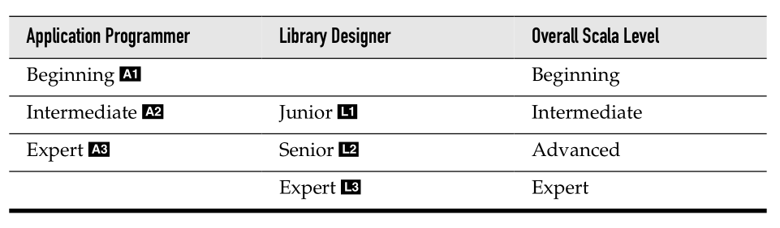

# Scala for the Impatient
---

### Book
[Scala for the impatient](http://www.horstmann.com/scala/index.html) -- Cay Horstmann

### Scala Levels

### Free download
A1 level chapters can be downloaded for free at [Typesafe](http://typesafe.com/resources/scala-for-the-impatient).

### Chapters and their levels
The [AL][1-3] refer to Martin Odersky's [Scala levels](http://www.scala-lang.org/node/8610).

1. The Basics (A1)
1. Control Structures and Functions (A1)
1. Arrays (A1)
1. Maps and Tuples (A1)
1. Classes (A1)
1. Objects (A1)
1. Packages and Imports (A1)
1. Inheritance (A1)
1. Files and Regular Expressions (A1)
1. Traits (L1)
1. Operators (L1)
1. Higher-Order Functions (L1)
1. Collections (A2)
1. Pattern Matching and Case Classes (A2)
1. Annotations (A2)
1. XML Processing (A2)
1. Type Parameters (L2)
1. Advanced Types  (L2)
1. Parsing and Domain-Specific Languages (A3)
1. Actors (A3)
1. Implicits (L3)
1. Delimited Continuations (L3)